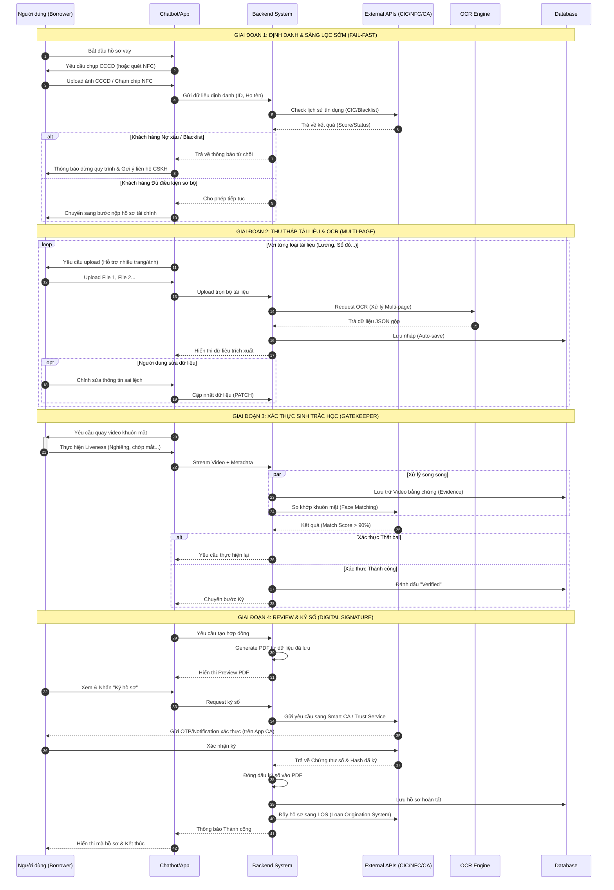

## HỆ THỐNG NỘP HỒ SƠ VAY MUA NHÀ TỰ ĐỘNG (AUTO‑MORTGAGE ONBOARDING)

**Phiên bản:** 2.1 (Final)

**Người thực hiện:** Senior Fintech BA (20+ năm kinh nghiệm)

**Ngày cập nhật:** 04/01/2026

---

# PHẦN 1 – URD (USER REQUIREMENT DOCUMENT)

## 1. Mục tiêu người dùng (User Goals)

* Hoàn tất hồ sơ vay mua nhà **100% online**
* Hạn chế nhập liệu thủ công
* Đảm bảo **an toàn – bảo mật – có giá trị pháp lý**
* Có thể hoàn tất hồ sơ trong **một phiên (single session)** hoặc tiếp tục sau

---

## 2. Chân dung người dùng (User Personas)

### 2.1 Người vay (Borrower)

* Cá nhân vay mua nhà
* Sử dụng mobile/web
* Không am hiểu nghiệp vụ ngân hàng
* Ưu tiên nhanh, rõ ràng, không lặp thao tác

### 2.2 Quản trị viên ngân hàng (Bank Admin)

* Cấu hình sản phẩm vay
* Quản lý form, tài liệu, rule OCR
* Không can thiệp nội dung hồ sơ

### 2.3 Kiểm soát rủi ro (Risk Officer)

* Hậu kiểm gian lận
* Xem video xác thực
* Đưa ra quyết định Escalate / Reject / Approve (ngoài hệ thống này)

---

## 3. User Stories

### Nhóm 1 – Quản trị hệ thống (Admin)

* **US_ADM_01:** Cấu hình danh sách tài liệu theo từng gói vay, phân loại *Bắt buộc / Tuỳ chọn*.
* **US_ADM_02:** Định nghĩa các trường dữ liệu form và ánh xạ với OCR output.
* **US_ADM_03 (Bổ sung):** Cấu hình ngưỡng OCR / Face Matching / Retry Policy theo sản phẩm vay.

### Nhóm 2 – Nộp hồ sơ & OCR (Borrower)

* **US_USR_01:** Được chatbot hướng dẫn upload từng tài liệu theo thứ tự.
* **US_USR_02:** Tự động điền form từ OCR.
* **US_USR_03:** Được chỉ rõ trường thiếu/sai để sửa ngay.
* **US_USR_03a (Bổ sung):** Có thể lưu tạm hồ sơ và tiếp tục sau (Resume).

### Nhóm 3 – Sinh trắc học & Video

* **US_USR_04:** Xác thực khuôn mặt để chứng minh tôi là chủ giấy tờ.
* **US_RISK_01:** Có video, timestamp làm bằng chứng pháp lý (non‑repudiation).

### Nhóm 4 – Review & Ký

* **US_USR_05:** Xem preview toàn bộ hồ sơ trước khi ký.
* **US_USR_06:** Ký điện tử sau khi xác thực thành công.

---

# PHẦN 2 – BRD (BUSINESS REQUIREMENT DOCUMENT)

## 1. Phạm vi nghiệp vụ (Business Scope)

### In‑scope

* Thu thập hồ sơ
* OCR & Mapping dữ liệu
* eKYC & Video Evidence
* Ký điện tử
* Đẩy hồ sơ sang LOS

### Out‑of‑scope

* Chấm điểm tín dụng
* Phê duyệt khoản vay
* Giải ngân

---

## 2. Quy trình nghiệp vụ To‑Be

1. **Khởi tạo phiên**

   * Khách hàng chọn sản phẩm vay
   * Hệ thống load cấu hình

2. **Upload & OCR**

   * Bắt buộc upload CCCD trước
   * OCR & fill form
   * Validate thiếu/sai

3. **Xác thực sinh trắc học (Gatekeeper)**

   * Liveness
   * Face matching
   * Ghi video

4. **Review & Ký**

   * Sinh PDF
   * Ký điện tử

5. **Submit**

   * Đóng gói hồ sơ + video
   * Gửi LOS
   * Trả trạng thái

---

## 3. Business Rules (Bổ sung quan trọng)

* **BR‑01:** Không cho phép xác thực khuôn mặt nếu chưa có CCCD hợp lệ.
* **BR‑02:** OCR chỉ mang tính gợi ý, dữ liệu cuối cùng là dữ liệu người dùng xác nhận.
* **BR‑03:** Mỗi phiên xác thực video gắn duy nhất với 1 hồ sơ.
* **BR‑04:** Thất bại sinh trắc học > N lần → chuyển Assisted Onboarding.

---

## 4. Functional Requirements

### 4.1 Admin Configuration

* **FR_CFG_01:** Quản lý danh mục tài liệu
* **FR_CFG_02:** OCR Mapping
* **FR_CFG_03 (Bổ sung):** Versioning form & template PDF

### 4.2 Chatbot & OCR

* **FR_BOT_01:** Upload tuần tự
* **FR_OCR_01:** OCR đa loại tài liệu
* **FR_OCR_02:** Confidence Threshold

### 4.3 Biometric (eKYC)

* **FR_BIO_01:** Liveness
* **FR_BIO_02:** Face Matching (>= configurable)
* **FR_BIO_03:** Video recording + watermark

### 4.4 Signing

* **FR_DOC_01:** PDF generation
* **FR_SIGN_01:** Ký điện tử có điều kiện

---

## 5. Non‑Functional Requirements

### Security & Compliance

* **NFR_SEC_01:** AES‑256, TLS 1.3
* **NFR_SEC_02 (Bổ sung):** RBAC + Audit log
* **NFR_CMP_01:** NĐ 13/2023/NĐ‑CP, consent bắt buộc

### Performance

* **NFR_PER_01:** OCR < 3s / trang
* **NFR_PER_02 (Bổ sung):** Hệ thống chịu tải ≥ X hồ sơ/phút

### Storage

* **NFR_STO_01:** Video ≥ 720p, H.264/H.265
* **NFR_STO_02 (Bổ sung):** Retention policy (VD: 5–10 năm)

---

# PHẦN 3 – LƯU Ý TRIỂN KHAI (CRITICAL)

* CCCD là dữ liệu gốc (Golden Record)
* UX video là điểm rơi khách → cần hướng dẫn trực quan
* Không hard‑block user → luôn có Assisted Onboarding
* Log đầy đủ cho pháp lý & tranh chấp

---

# PHẦN 4 – Sơ đồ Mermaid.

