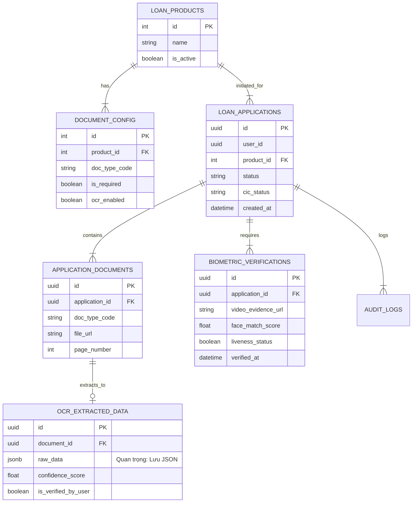

```mermaid
erDiagram
    LOAN_PRODUCTS ||--|{ DOCUMENT_CONFIG : "has"
    LOAN_PRODUCTS ||--|{ LOAN_APPLICATIONS : "initiated_for"
    
    LOAN_APPLICATIONS ||--|{ APPLICATION_DOCUMENTS : "contains"
    LOAN_APPLICATIONS ||--|{ BIOMETRIC_VERIFICATIONS : "requires"
    LOAN_APPLICATIONS ||--|{ AUDIT_LOGS : "logs"

    APPLICATION_DOCUMENTS ||--o| OCR_EXTRACTED_DATA : "extracts_to"

    LOAN_PRODUCTS {
        int id PK
        string name
        boolean is_active
    }

    DOCUMENT_CONFIG {
        int id PK
        int product_id FK
        string doc_type_code
        boolean is_required
        boolean ocr_enabled
    }

    LOAN_APPLICATIONS {
        uuid id PK
        uuid user_id
        int product_id FK
        string status
        string cic_status
        datetime created_at
    }

    APPLICATION_DOCUMENTS {
        uuid id PK
        uuid application_id FK
        string doc_type_code
        string file_url
        int page_number
    }

    OCR_EXTRACTED_DATA {
        uuid id PK
        uuid document_id FK
        jsonb raw_data "Quan trọng: Lưu JSON"
        float confidence_score
        boolean is_verified_by_user
    }

    BIOMETRIC_VERIFICATIONS {
        uuid id PK
        uuid application_id FK
        string video_evidence_url
        float face_match_score
        boolean liveness_status
        datetime verified_at
    }
```
