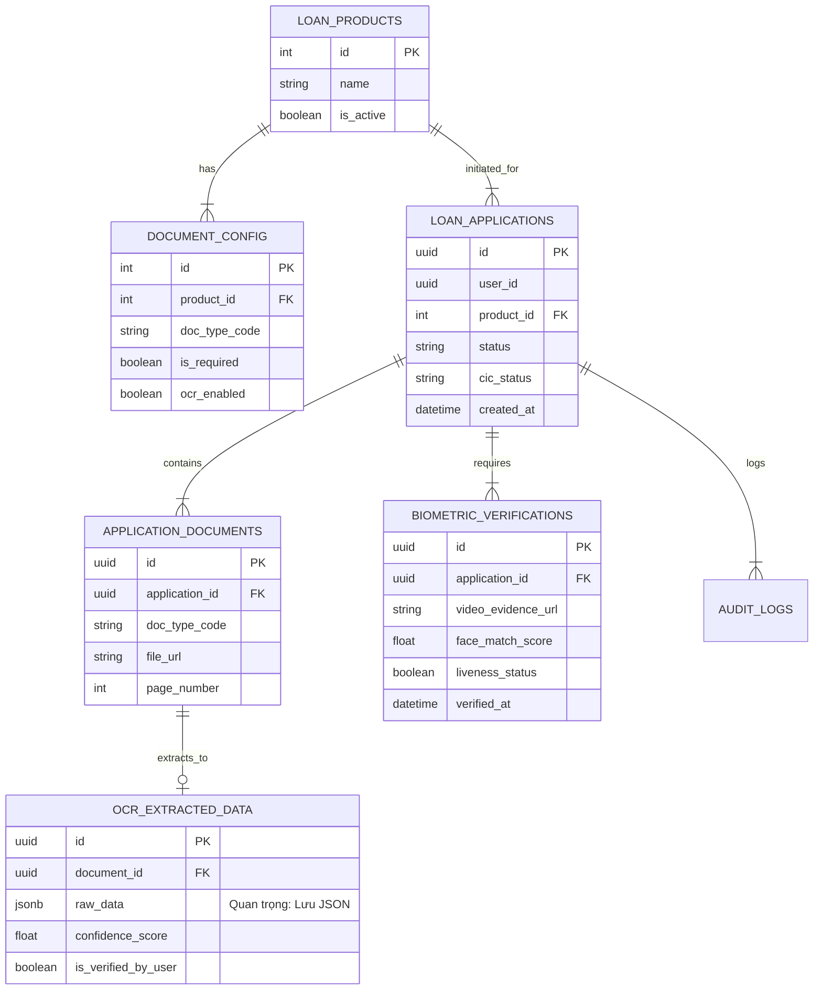

Dưới đây là thiết kế chi tiết (Schema Design) và biểu đồ ERD để bạn đưa vào tài liệu.

1. Chiến lược lưu trữ (Storage Strategy)
Structured Data (Metadata): Lưu trong RDBMS (SQL Server/PostgreSQL). Dùng để quản lý trạng thái hồ sơ, thông tin user, kết quả OCR.

Unstructured Data (Files): Toàn bộ ảnh chụp CCCD, file PDF hồ sơ, Video quay khuôn mặt TUYỆT ĐỐI KHÔNG lưu trực tiếp vào Database (BLOB). Hãy lưu chúng trên Object Storage và chỉ lưu đường dẫn (File Path/URL) vào Database.

Flexible Data (OCR): Dữ liệu trả về từ OCR thường không cố định (lúc thì có "Nơi cấp", lúc thì không). Hãy sử dụng kiểu dữ liệu JSON/JSONB cho các trường này thay vì tạo quá nhiều cột cứng.

2. Thiết kế chi tiết các bảng (Database Schema)
Nhóm 1: Core & Configuration (Cấu hình & Hồ sơ)
1. loan_products (Sản phẩm vay) Bảng này giúp Admin cấu hình các gói vay (US_ADM_01).

id (PK, int): Mã sản phẩm.

name (varchar): Tên gói (VD: Vay mua nhà dự án).

is_active (boolean): Trạng thái kích hoạt.

2. document_config (Cấu hình tài liệu) Quy định gói vay nào cần giấy tờ gì.

id (PK, int)

product_id (FK): Thuộc gói vay nào.

doc_type_code (varchar): Mã loại (VD: CCCD, LABOR_CONTRACT, SALARY_STATEMENT).

is_required (boolean): Bắt buộc hay không.

ocr_enabled (boolean): Có chạy OCR cho loại này không.

3. loan_applications (Hồ sơ vay - Bảng trung tâm)

id (PK, UUID): Mã hồ sơ (Dùng UUID để bảo mật, tránh đoán mã).

user_id (FK): Người vay.

product_id (FK): Gói vay.

status (enum): DRAFT, PROCESSING, WAITING_SIGN, SUBMITTED, REJECTED.

cic_status (enum): PASSED, FAILED (Kết quả check CIC sơ bộ).

created_at (datetime).

updated_at (datetime).

Nhóm 2: Documents & OCR Data (Tài liệu & Dữ liệu)
4. application_documents (File tài liệu đã upload)

id (PK, UUID)

application_id (FK): Thuộc hồ sơ nào.

doc_type_code (varchar): Loại giấy tờ (Map với config).

file_url (varchar): Đường dẫn lưu file ảnh/PDF (trên S3/MinIO).

page_number (int): Số thứ tự trang (hỗ trợ tài liệu nhiều trang).

uploaded_at (datetime).

5. ocr_extracted_data (Kết quả OCR)

id (PK, UUID)

document_id (FK): Của tài liệu nào.

raw_data (JSON/JSONB): Lưu toàn bộ kết quả OCR trả về (VD: {"id_number": "001...", "name": "Nguyen Van A"}). Dùng JSON giúp bạn không phải sửa DB khi OCR engine thay đổi output.

confidence_score (float): Độ tin cậy trung bình (VD: 0.95).

is_verified_by_user (boolean): Người dùng đã sửa/confirm chưa.

Nhóm 3: Security & Evidence (Sinh trắc học & Ký)
6. biometric_verifications (Kết quả eKYC)

id (PK, UUID)

application_id (FK): Xác thực cho hồ sơ nào.

video_evidence_url (varchar): Đường dẫn file video quay khuôn mặt.

face_match_score (float): Điểm trùng khớp (0.0 - 100.0).

liveness_status (boolean): Kết quả kiểm tra người thật.

nfc_data_verification (boolean): (Optional) Kết quả đọc chip NFC.

verified_at (datetime).

7. audit_logs (Nhật ký hệ thống - Quan trọng cho pháp lý)

id (PK, BigInt)

application_id (FK)

action (varchar): UPLOAD_DOC, EDIT_OCR, EKYC_FAIL, SIGN_DOCUMENT.

ip_address (varchar): IP người dùng.

device_info (text): Thông tin thiết bị.

timestamp (datetime).

