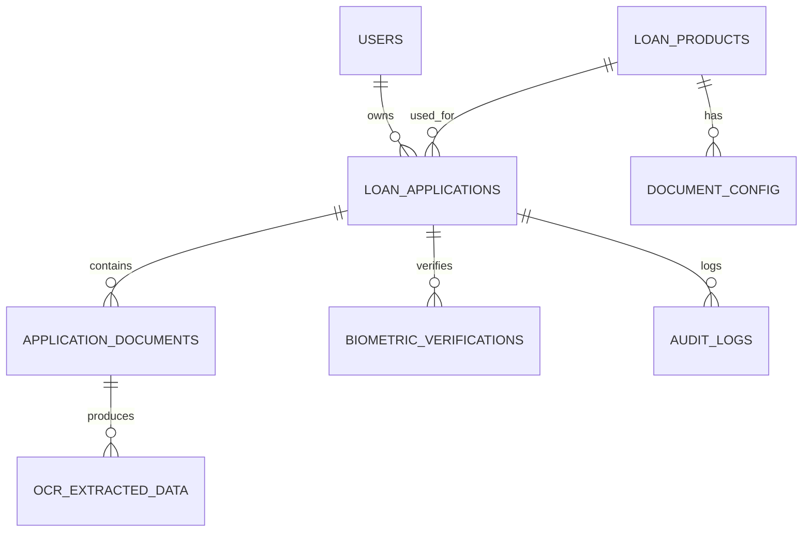

Dưới đây là thiết kế chi tiết (Schema Design) và biểu đồ ERD để bạn đưa vào tài liệu.

1. Chiến lược lưu trữ (Storage Strategy)
Structured Data (Metadata): Lưu trong RDBMS (SQL Server/PostgreSQL). Dùng để quản lý trạng thái hồ sơ, thông tin user, kết quả OCR.

Unstructured Data (Files): Toàn bộ ảnh chụp CCCD, file PDF hồ sơ, Video quay khuôn mặt TUYỆT ĐỐI KHÔNG lưu trực tiếp vào Database (BLOB). Hãy lưu chúng trên Object Storage và chỉ lưu đường dẫn (File Path/URL) vào Database.

Flexible Data (OCR): Dữ liệu trả về từ OCR thường không cố định (lúc thì có "Nơi cấp", lúc thì không). Hãy sử dụng kiểu dữ liệu JSON/JSONB cho các trường này thay vì tạo quá nhiều cột cứng.

2. Thiết kế chi tiết các bảng (Database Schema)
Nhóm 1: Core & Configuration (Cấu hình & Hồ sơ)
1. loan_products (Sản phẩm vay) Bảng này giúp Admin cấu hình các gói vay (US_ADM_01).

id (PK, int): Mã sản phẩm.

name (varchar): Tên gói (VD: Vay mua nhà dự án).

is_active (boolean): Trạng thái kích hoạt.

2. document_config (Cấu hình tài liệu) Quy định gói vay nào cần giấy tờ gì.

id (PK, int)

product_id (FK): Thuộc gói vay nào.

doc_type_code (varchar): Mã loại (VD: CCCD, LABOR_CONTRACT, SALARY_STATEMENT).

is_required (boolean): Bắt buộc hay không.

ocr_enabled (boolean): Có chạy OCR cho loại này không.

3. loan_applications (Hồ sơ vay - Bảng trung tâm)

id (PK, UUID): Mã hồ sơ (Dùng UUID để bảo mật, tránh đoán mã).

user_id (FK): Người vay.

product_id (FK): Gói vay.

status (enum): DRAFT, PROCESSING, WAITING_SIGN, SUBMITTED, REJECTED.

cic_status (enum): PASSED, FAILED (Kết quả check CIC sơ bộ).

created_at (datetime).

updated_at (datetime).

Nhóm 2: Documents & OCR Data (Tài liệu & Dữ liệu)
4. application_documents (File tài liệu đã upload)

id (PK, UUID)

application_id (FK): Thuộc hồ sơ nào.

doc_type_code (varchar): Loại giấy tờ (Map với config).

file_url (varchar): Đường dẫn lưu file ảnh/PDF (trên S3/MinIO).

page_number (int): Số thứ tự trang (hỗ trợ tài liệu nhiều trang).

uploaded_at (datetime).

5. ocr_extracted_data (Kết quả OCR)

id (PK, UUID)

document_id (FK): Của tài liệu nào.

raw_data (JSON/JSONB): Lưu toàn bộ kết quả OCR trả về (VD: {"id_number": "001...", "name": "Nguyen Van A"}). Dùng JSON giúp bạn không phải sửa DB khi OCR engine thay đổi output.

confidence_score (float): Độ tin cậy trung bình (VD: 0.95).

is_verified_by_user (boolean): Người dùng đã sửa/confirm chưa.

Nhóm 3: Security & Evidence (Sinh trắc học & Ký)
6. biometric_verifications (Kết quả eKYC)

id (PK, UUID)

application_id (FK): Xác thực cho hồ sơ nào.

video_evidence_url (varchar): Đường dẫn file video quay khuôn mặt.

face_match_score (float): Điểm trùng khớp (0.0 - 100.0).

liveness_status (boolean): Kết quả kiểm tra người thật.

nfc_data_verification (boolean): (Optional) Kết quả đọc chip NFC.

verified_at (datetime).

7. audit_logs (Nhật ký hệ thống - Quan trọng cho pháp lý)

id (PK, BigInt)

application_id (FK)

action (varchar): UPLOAD_DOC, EDIT_OCR, EKYC_FAIL, SIGN_DOCUMENT.

ip_address (varchar): IP người dùng.

device_info (text): Thông tin thiết bị.

timestamp (datetime).


# Database Design – Auto Mortgage Onboarding (Final)

## Overview
This document describes the **final database design** for the Auto-Mortgage Onboarding system.
It is production-ready for **Fintech / Banking environments**, supports **OCR, eKYC, audit**, and long-term compliance.

**Role:** Tech Lead / Solution Architect  
**Version:** Final  
**Last Updated:** 04/01/2026

---

## 1. Storage Strategy

### 1.1 Structured Data
- Stored in **Relational Database** (PostgreSQL / SQL Server)
- Used for:
  - Loan applications
  - User identity
  - Workflow status
  - Audit & compliance

### 1.2 Unstructured Data
- Stored in **Object Storage** (MinIO / AWS S3)
- Includes:
  - CCCD images
  - Income documents (PDF)
  - eKYC video evidence
- **Never store BLOB in database**
- Database stores **object_key**, not public URL

### 1.3 Flexible OCR Data
- OCR output is semi-structured
- Stored as **JSONB (PostgreSQL)** or **NVARCHAR(MAX) + ISJSON (SQL Server)**

---

## 2. Database Schema

### 2.1 Users (Borrowers)

```sql
users
- id (UUID, PK)
- phone (varchar)
- email (varchar)
- status (enum: ACTIVE, LOCKED)
- created_at (datetime)
```

---

### 2.2 Loan Products

```sql
loan_products
- id (int, PK)
- name (varchar)
- is_active (boolean)
```

---

### 2.3 Document Configuration

```sql
document_config
- id (int, PK)
- product_id (FK)
- doc_type_code (varchar)
- is_required (boolean)
- ocr_enabled (boolean)
- version (int)
```

---

### 2.4 Loan Applications (Central Table)

```sql
loan_applications
- id (UUID, PK)
- user_id (UUID, FK)
- product_id (int, FK)
- status (enum)
- cic_status (enum)
- current_step (varchar)
- created_at (datetime)
- updated_at (datetime)
```

---

### 2.5 Application Documents

```sql
application_documents
- id (UUID, PK)
- application_id (UUID, FK)
- doc_type_code (varchar)
- file_object_key (varchar)
- page_number (int)
- uploaded_at (datetime)
```

---

### 2.6 OCR Extracted Data

```sql
ocr_extracted_data
- id (UUID, PK)
- document_id (UUID, FK)
- raw_data (JSONB)
- normalized_data (JSONB)
- confidence_score (float)
- is_verified_by_user (boolean)
- extracted_at (datetime)
```

---

### 2.7 Biometric Verifications

```sql
biometric_verifications
- id (UUID, PK)
- application_id (UUID, FK)
- attempt_no (int)
- video_object_key (varchar)
- face_match_score (float)
- liveness_status (boolean)
- nfc_data_verified (boolean)
- verified_at (datetime)
```

---

### 2.8 Audit Logs

```sql
audit_logs
- id (bigint, PK)
- application_id (UUID, FK)
- actor_type (enum: USER, SYSTEM, ADMIN)
- actor_id (UUID)
- action (varchar)
- old_value (JSONB)
- new_value (JSONB)
- ip_address (varchar)
- device_info (text)
- created_at (datetime)
```

---

## 3. ERD (Mermaid)



---

## 4. Indexing Strategy

- loan_applications(user_id, status)
- application_documents(application_id)
- biometric_verifications(application_id)
- audit_logs(application_id)
- document_config(product_id, doc_type_code)

---

## 5. Security & Compliance Notes

- Use **Presigned URL (5–10 minutes)** for file access
- Encrypt data:
  - At rest: AES-256
  - In transit: TLS 1.3
- Retention policy:
  - OCR data: 5–7 years
  - eKYC video: 7–10 years

---

## 6. Final Assessment

✔ Production-ready for banking  
✔ Audit & compliance compliant  
✔ Scalable for millions of applications  
✔ AI/OCR friendly  

